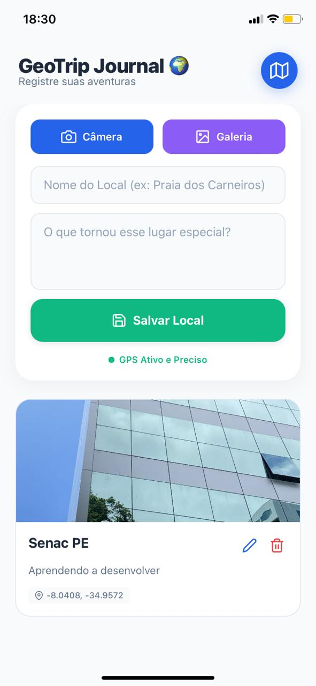
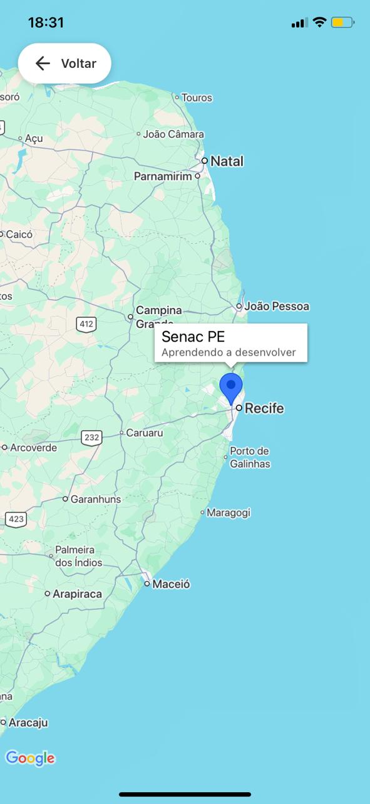

# GeoTrip Journal 🌍✈️


[](./LICENSE)

> Uma solução Fullstack (Backend + Mobile) para registrar suas viagens, salvando locais com fotos, descrições e visualização em mapa interativo.

---

## 📸 Screenshots

| Tela Inicial (Lista) | Visualização no Mapa |
|:-------------------:|:-----------------:|
|  |  |

---

## 📜 Sobre o Projeto

O **GeoTrip Journal** é um aplicativo desenvolvido para atuar como um diário de bordo digital. Diferente de um simples CRUD, ele utiliza recursos nativos do dispositivo para enriquecer a experiência do usuário.

Este repositório opera como um **Monorepo**, contendo tanto a API (Backend) quanto o Aplicativo (Mobile) em uma única estrutura organizada.

O sistema permite capturar a localização exata via GPS, anexar fotos (da câmera ou galeria) e visualizar todos os pontos registrados em um mapa dinâmico.

---

## ✨ Funcionalidades

* **Geolocalização Automática:** Captura a latitude e longitude do usuário no momento do cadastro.
* **Multimídia:** Suporte para tirar fotos na hora ou escolher da galeria.
* **Mapa Interativo:** Visualização global de todos os locais visitados com marcadores personalizados (utilizando Google Maps).
* **Gestão de Memórias:**
    * Criar novos registros de viagem.
    * Editar informações e fotos.
    * Excluir registros indesejados.
* **Feedback Visual:** Interface moderna com validações, loadings e tratamento de erros.

---

## 🚀 Tecnologias Utilizadas

### Backend (API)
* **Node.js** & **Express**
* **MongoDB Atlas** (Banco de dados em nuvem)
* **Mongoose** (Modelagem de dados)
* **Cors** & **Dotenv**

### Mobile (App)
* **React Native** & **Expo**
* **TypeScript**
* **Axios** (Integração com API)
* **React Native Maps** (Visualização de mapas)
* **Expo Location** (GPS)
* **Expo Image Picker** (Câmera e Galeria)

---

## ⚙️ Como Executar Localmente

Como este é um projeto Fullstack, você precisará de **dois terminais** abertos simultaneamente.

**Pré-requisitos:**
* [Node.js](https://nodejs.org/) instalado.
* Conta no [MongoDB Atlas](https://www.mongodb.com/cloud/atlas) (para a string de conexão).
* Dispositivo físico (com app Expo Go) ou Emulador configurado.

### Passo 1: Clonar o Projeto

1. **Clone o repositório para sua máquina:**
   ```bash
   git clone https://github.com/jmtmds/geo-fullstack.git
   ```

2. **Entre na pasta do projeto:**
   ```bash
   cd geo-fullstack
   ```

### Passo 2: Configurando o Backend

1. **Navegue até a pasta do backend:**
   ```bash
   cd backend
   ```

2. **Instale as dependências:**
   ```bash
   npm install
   ```

3. **Configure as variáveis de ambiente:**
   * Crie um arquivo `.env` na pasta `backend` (baseado no `.env.example`).
   * Adicione sua string de conexão do MongoDB:
     ```env
     PORT=3000
     MONGO_URI=sua_string_de_conexao_mongodb
     ```

4. **Inicie o servidor:**
   ```bash
   npm run dev
   ```
   *O backend rodará na porta 3000.*

---

### Passo 3: Configurando o Mobile

1. **Abra um novo terminal e navegue até a pasta mobile:**
   ```bash
   cd mobile
   ```

2. **Instale as dependências:**
   ```bash
   npm install
   ```

3. **Configure o IP da API:**
   * Como o app rodará no celular, ele não reconhece "localhost".
   * Crie um arquivo `api-config.ts` dentro da pasta `mobile`.
   * Adicione o IP da sua máquina (descubra usando `ipconfig` ou `ifconfig`):
     ```typescript
     // mobile/api-config.ts
     export const API_URL = 'http://SEU_IP_AQUI:3000/api/places';
     ```

4. **Inicie o projeto:**
   ```bash
   npx expo start
   ```

5. **Teste:**
   * Escaneie o QR Code com o app **Expo Go** no seu Android ou iOS.

---

## 👨‍💻 Autor

**João Marcos Tavares**

* **LinkedIn:** [linkedin.com/in/jmtmds](https://www.linkedin.com/in/jmtmds)
* **Email:** [jm3tavares@gmail.com](mailto:jm3tavares@gmail.com)
* **GitHub:** [github.com/jmtmds](https://github.com/jmtmds)
